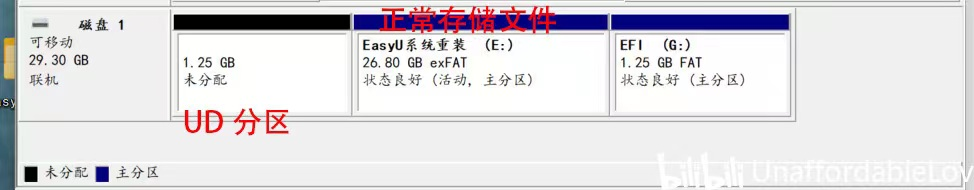
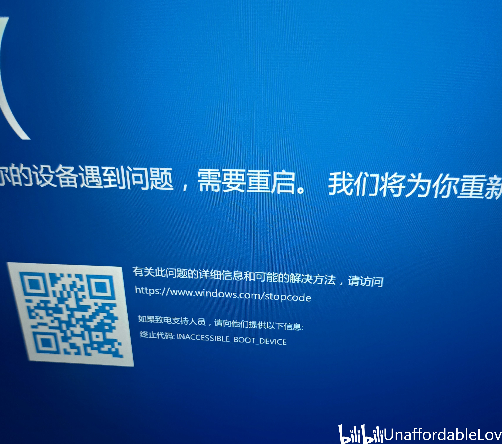
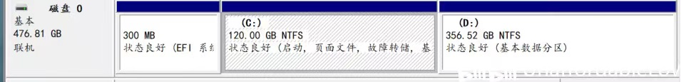
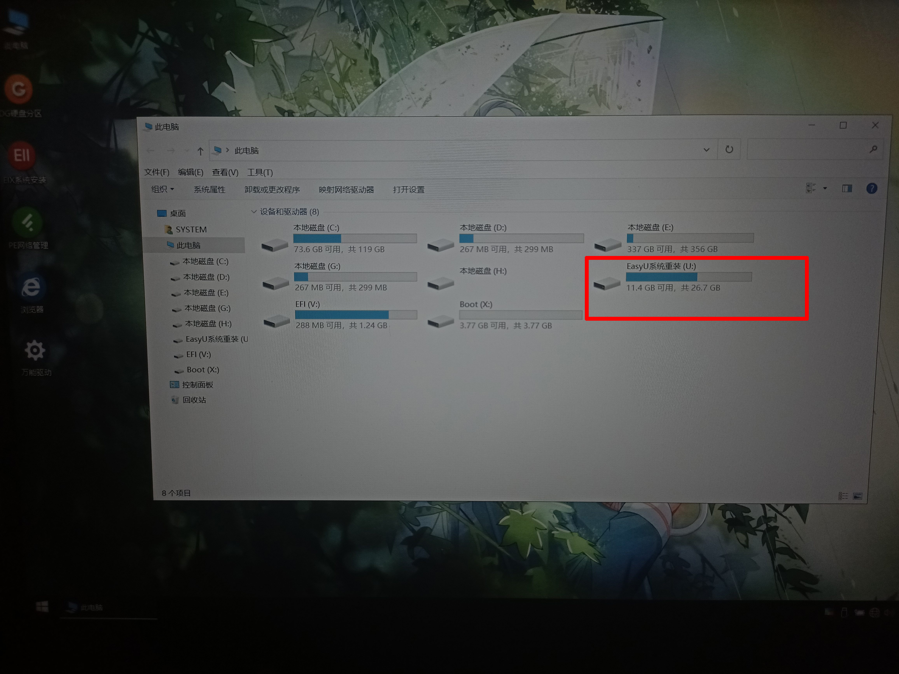
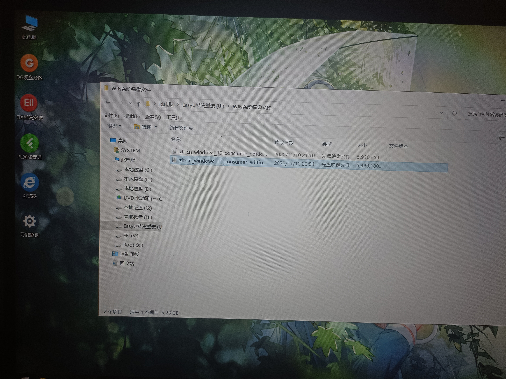

# WINDOWS_SYSTEM_REINSTALL
###### 关键词：INACCESSIBLE_BOOT_DEVICE，系统重装蓝屏，windows系统纯净重装，NO BOOT DEVICE
 
>介绍：
>>1、本文是我多次重装系统所总结的经验，发表文章只是分享快乐；  
>>2、本文初次分享是在 bilibili（<http://b23.tv/Nhkr5Un>）；  

#### 文章结构：直入主题（***<a href="#s2">正文</a>***）+ 重装认知/谏言（***<a href="#s1">其它</a>***）

***<h2 id="s2" align="center"> 正文 </h3>***
##### 两个磁盘分区为例
> 注意：在重装系统时确保<b>重要文件</b>已经拷贝，一般情况下，PE系统可以进行文件拷贝。  
> 建议：可以再分一个区别于c、d盘的e盘来存放拷贝的文件（优盘显得更鸡肋），包括iso镜像文件（重装速度更快）。这些建议的前提是：在重装前计算机依然能够正常使用！

&emsp;&emsp;①优启通，wepe......可以直接部署PE系统在电脑磁盘，建议部署到U盘，镜像文件也准备好；再次强调：PE系统格式化C盘时确保重要文件已拷备，PE系统可以进行文件拷贝！（注意：一个分区只能存在一个操作系统！）  
&emsp;&emsp;②PE系统启动U盘：

<body>

别犯傻乱删

</body>

> <略> 进阶一点的玩法：使用微PE部署工具生成ISO启动文件存放到 [ventoy](https://www.ventoy.net/cn/index.html) 启动U盘。

&emsp;&emsp;制作PE系统我使用的是优启通，在使用wepe时它无法识别出我的本地磁盘，因此无法进行磁盘清空操作。  
&emsp;&emsp;微软官方制作的启动U盘也无法识别我的本地磁盘。（放弃）

<body>

</body>

**！❗！注意：**
<body>

不要在这里进行系统部署

</body>

#### 不要使用PE盘自带的程序进行系统安装！！！  
否则会如下：

<body>

其实就是启动引导出bug了，或者说是引导写错了

</body>

&emsp;&emsp;EFI分区无法引导系统盘正常启动，也就是它与系统盘是的联系是脱节的，直接蓝屏报错，无限重启。这就是第三方装机工具的问题了（应该是WinNTsetup的问题）。按我说的这个方法来安装系统，其实就是将引导及其安装过程全权交由iso文件内的安装程序来执行。

&emsp;&emsp;最后，完美的安装方式：微PE的操作系统就是精简版WIN操作系统，ISO文件在内作为可执行文件（同时也是压缩文件）可以直接运行。系统磁盘也可以完美识别，还可以通过 DOS 进行格式化和分区操作，使用 diskgenius 分区工具即可。（专业版就够用了，windows消费者版本没有企业版哈。
想要了解家庭版，专业版和企业版的差别可百度到对比信息。） 
<body>

</body>
Windows镜像可以去微软官方网站下载，还有MSDN网站，都是纯净无修改的。至此，本文的主题、目的结束。  

 
其他答疑：

&emsp;&emsp;我们这样安装的默认需要创建管理员用户，通过登录微软账户（也可以跳过到到后期）创建管理员（只是可能有些麻烦）。  
&emsp;&emsp;系统默认关闭最高权限管理员账户（administrator）, 我们最好也别去开启最高权限用户，这也是不安全的（针对一些不知明&不安全的程序或指令静默运行，以及用户可能犯傻乱删），普通管理员是无法删除系统文件的。并且administrator账户被黑客破译的可能性更大，当然我们也只是普通用户。bitblock的功能不再赘述，windows的PIN密码是可以强制破译的。
 &emsp;&emsp;

***<h2 id="s1" align="center"> 其它 </h3>***

重装系统推荐：微软官方一键重装，[优启通](https://www.itsk.com/thread/430619)👍，[wepe](https://www.wepe.com.cn/download.html)。  
&emsp;&emsp;系统重装保姆级教程 👉[硬件茶谈](https://www.bilibili.com/video/BV1DJ411D79y/)（bilibili）！另外，我的这个重装教程并不进阶，
只是需要有一定电脑基础理论知识的认知，也是<u>**后期最简单易用**</u>的。  

<body>

</body>

唠嗑：  
&emsp;&emsp;我用的是华硕笔记本电脑 /华硕无畏16/，电脑到手一个月多几天，重装系统差不多10次保底。
用过微软官方一键重装，韩博士，云骑士，大白菜，wepe，优启通。  
&emsp;&emsp;可以将pe系统安装本地磁盘（重装完成后可以在 系统配置 中删除pe），但我们更多的都安装在优盘。（将PE系统安装到电脑磁盘可能对某些电脑不适用！或者说是需要关闭BIOS的某些功能）  
&emsp;&emsp;Bitblock起到保护磁盘数据的作用，但推荐关闭这个功能。磁盘分区C盘推荐80~160G（磁盘512G为准）。  
&emsp;&emsp;系统报错：INACCESSIBLE_BOOT_DEVICE（无法访问启动设备）的原因有很多种，[傲梅科技](https://www.abackup.com/easybackup-tutorials/inaccessible-boot-device-windows-10-6540.html) 
发表的文章就总结的比较全，网上的解决说法也是让人抓狂，什么安全模式启动，需要关这关那的，实操根本没啥用，因为一般人根本折腾不动。本文侧重的是系统重装,重装是最快解决问题的办法！
还有一种：NO BOOT DEVICE，字面上的翻译，就是 EFI 引导没了，后面重启就只会到那个厂商为硬件刷入的BIOS面板，这个就需要用某些工具通过pe系统进行引导修复（没接触过），或者说直接重装👍。

>注意：电脑只要没有人为在物理上对电脑有故意或非故意性的损坏，在一般情况下，都能通过重装解决 99% 的鸡皮蒜毛问题。  

①单纯的升级系统推荐使用微软官方的工具；  
②另外是系统故障，需要重装，或者自己想要换个系统，这就会用到一些第三方重装软件。  
&emsp;&emsp;典型的韩博士，云骑士，小白装机，大白菜这些都捆绑了一些软件，觉得可以忍受倒是没啥大问题，都可以用。捆绑后面可以手动卸载。但是！亟可能存在一些安全问题。并且这些第三方软件在重装完后，默认直接启用的是 administrator 用户（不建议使用）。WEPE，优启通，[冰封PE](http://www.bfgho.com/)，[FirPE](https://firpe.cn/page-196) 都是无捆绑的好工具。

<body>

~END~

</body>
